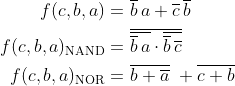

# 01-gates

## Link na môj GitHub

https://github.com/SimonJaraby/Digital-electronics-1

## Overenie si De Morganových zákonov

### Fukncie



### Implementation in VHDL

```vhdl
architecture dataflow of gates is
begin
    f_o  <= ((not b_i) and a_i) or ((not c_i) and (not b_i));
    fnand_o <= not (not (not b_i and a_i) and not(not b_i and not c_i));
    fnor_o <= (not (b_i or not a_i)) or (not (c_i or b_i));

end architecture dataflow;
```

### Logical table

| **c** | **b** |**a** | **f(c,b,a)** |
| :-: | :-: | :-: | :-: |
| 0 | 0 | 0 | 1 |
| 0 | 0 | 1 | 1 |
| 0 | 1 | 0 | 0 |
| 0 | 1 | 1 | 0 |
| 1 | 0 | 0 | 0 |
| 1 | 0 | 1 | 1 |
| 1 | 1 | 0 | 0 |
| 1 | 1 | 1 | 0 |

### Time waveforms


### Playground link

https://www.edaplayground.com/x/8Q97

## Verification of Distributive laws

### Equations


### Implementation in VHDL

```vhdl
architecture dataflow of gates is
begin
   	f1_o <= (a_i and b_i)or(a_i and c_i);
	f2_o <= a_i and (b_i or c_i);
	f3_o <= (a_i or b_i) and (a_i or c_i);
	f4_o <= a_i or (b_i and c_i);

end architecture dataflow;
```

### Time waveforms


### Playground link

https://www.edaplayground.com/x/cvK3
