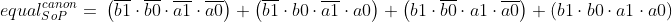
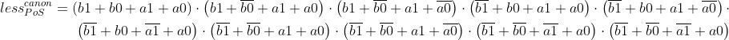
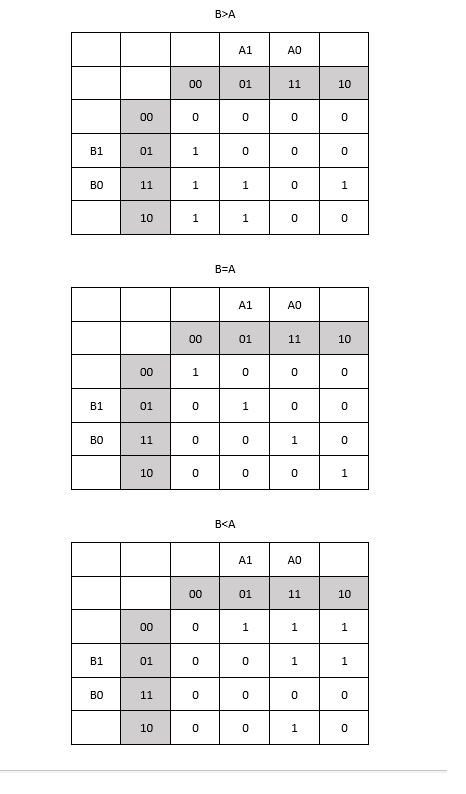
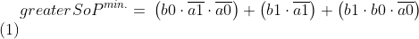
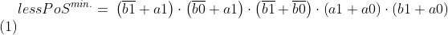

# **02-logical**

##  1. Prípravné úlohy
*Pravdivostná tabuľka 2-bit comparatora*

| **Dec. equivalent** | **B[1:0]** | **A[1:0]** | **B is greater than A** | **B equals A** | **B is less than A** |
| :-: | :-: | :-: | :-: | :-: | :-: |
| 0 | 0 0 | 0 0 | 0 | 1 | 0 |
| 1 | 0 0 | 0 1 | 0 | 0 | 1 |
| 2 | 0 0 | 1 0 | 0 | 0 | 1 |
| 3 | 0 0 | 1 1 | 0 | 0 | 1 |
| 4 | 0 1 | 0 0 | 1 | 0 | 0 |
| 5 | 0 1 | 0 1 | 0 | 1 | 0 |
| 6 | 0 1 | 1 0 | 0 | 0 | 1 |
| 7 | 0 1 | 1 1 | 0 | 0 | 1 |
| 8 | 1 0 | 0 0 | 1 | 0 | 0 |
| 9 | 1 0 | 0 1 | 1 | 0 | 0 |
| 10 | 1 0 | 1 0 | 0 | 1 | 0 |
| 11 | 1 0 | 1 1 | 0 | 0 | 1 |
| 12 | 1  1| 0 0 | 1 | 0 | 0 |
| 13 | 1 1 | 0 1 | 1 | 0 | 0 |
| 14 | 1 1 | 1 0 | 1 | 0 | 0 |
| 15 | 1 1 | 1 1 | 0 | 1 | 0 |

### *Funkcie*






## 2. 2-bitový komparátor
*Karnaughova mapa pre všetky funkcie*


### *Funkcie*





### *EDA Playground link*

https://www.edaplayground.com/x/8Q97

## 4-bitový binárny komparátor.

### Implementácia vo VHDL

```vhdl
architecture dataflow of gates is
begin
   	f1_o <= (a_i and b_i)or(a_i and c_i);
	f2_o <= a_i and (b_i or c_i);
	f3_o <= (a_i or b_i) and (a_i or c_i);
	f4_o <= a_i or (b_i and c_i);

end architecture dataflow;
```

### EDA Playground link

https://www.edaplayground.com/x/cvK3
