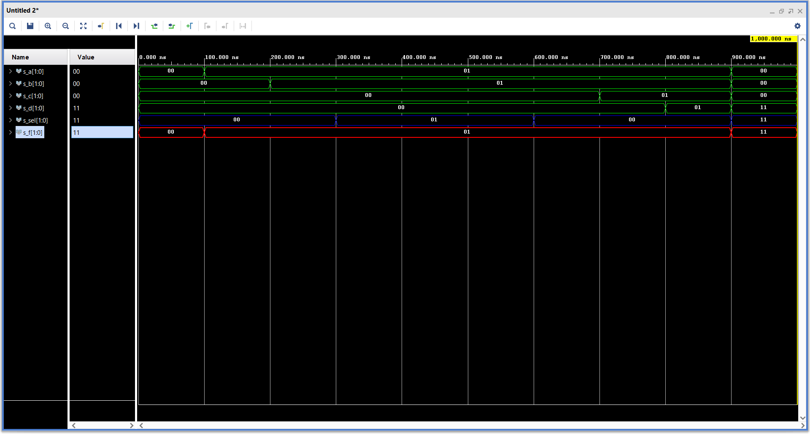
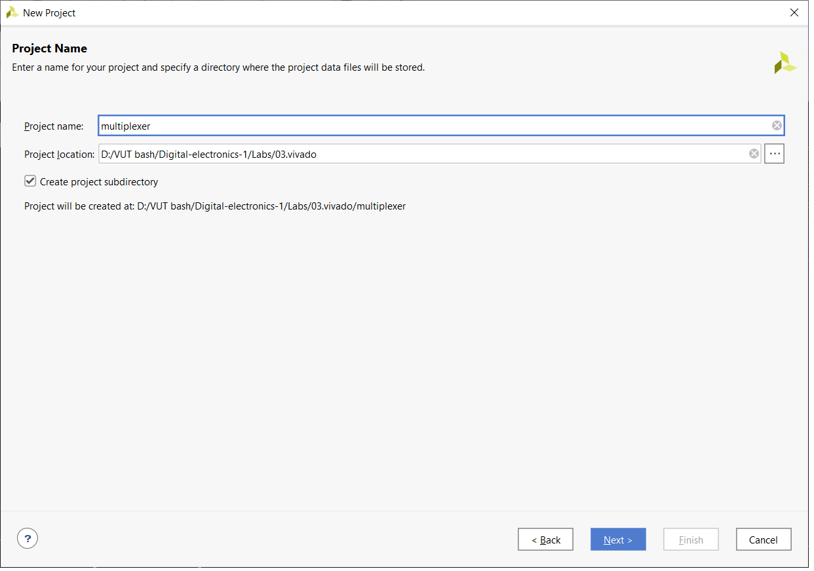
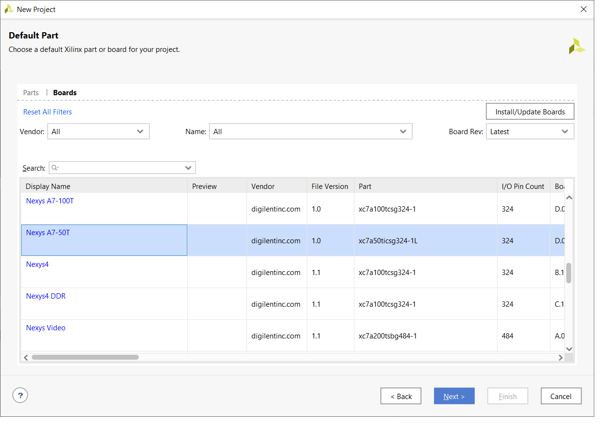
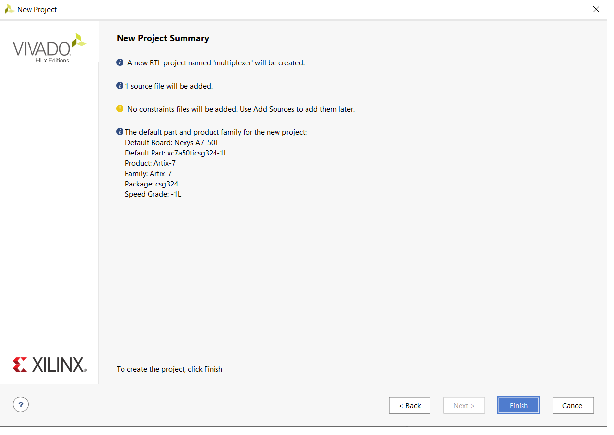
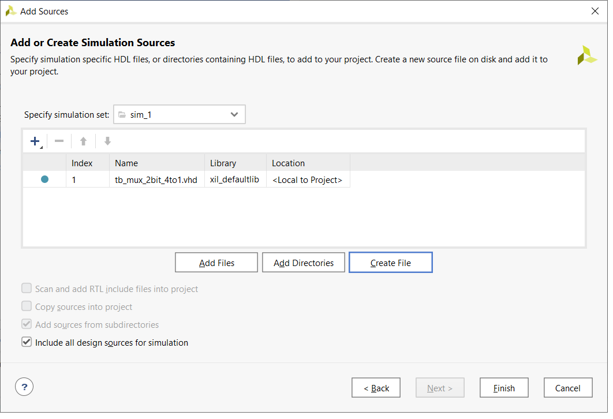
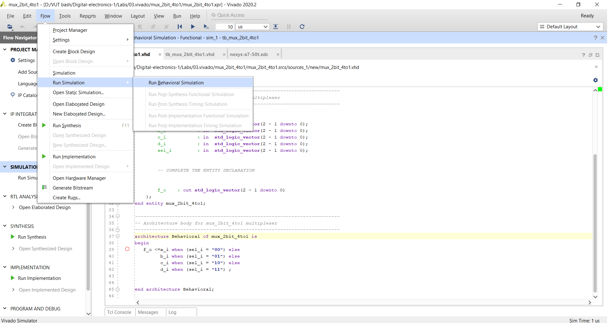
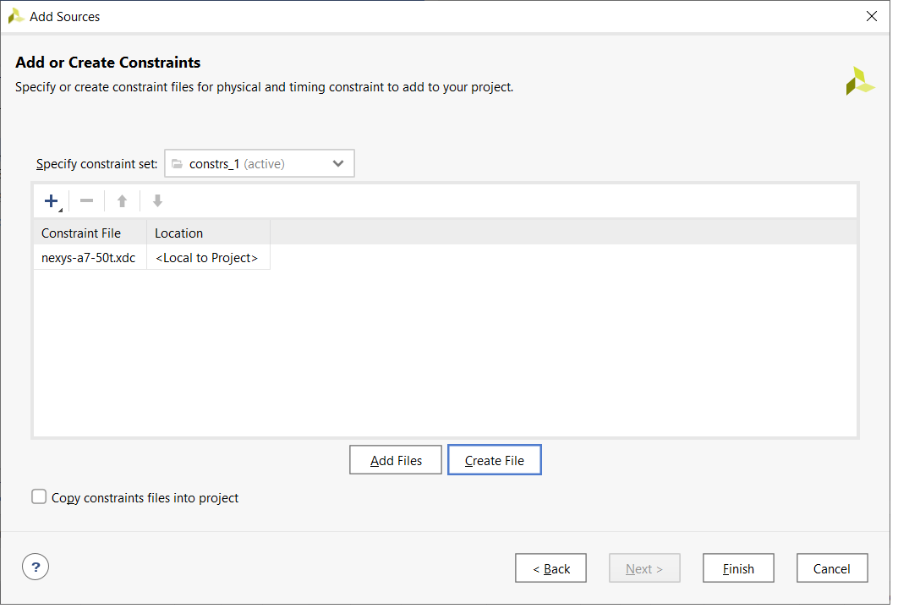

# **03-logical**

## **1. Preparation tasks**

| **LED** | **Connection** | **Switch** | **Connection** | 
| :-: | :-: | :-: | :-: |
| LED0 | H17 | SW0 | J15 |
| LED1 | K15 | SW1 | L16 |
| LED2 | J13 | SW2 | M13 |
| LED3 | N14 | SW3 | R15 |
| LED4 | R18 | SW4 | R17 |
| LED5 | V17 | SW5 | T18 |
| LED6 | U17 | SW6 | U18 |
| LED7 | U16 | SW7 | R13 |
| LED8 | V16 | SW8 | T8 |
| LED9 | T15 | SW9 | U8 |
| LED10 | U14 | SW10 | R16 |
| LED11 | T16 | SW11 | T13 |
| LED12 | V15 | SW12 | H6 |
| LED13 | V14 | SW13 | U12 |
| LED14 | V12 | SW14 | U11 |
| LED15 | V11 | SW15 | V10 |


## **2. Two-bit wide 4-to-1 multiplexer**

### *VHDL architecture*
```vhdl
architecture Behavioral of mux_2bit_4to1 is
begin
   f_o <=a_i when (sel_i = "00") else
         b_i when (sel_i = "01") else
         c_i when (sel_i = "10") else
         d_i when (sel_i = "11") ;

end architecture Behavioral;
```
### *VHDL stimulus*
```vhdl
 p_stimulus : process
    begin
        -- Report a note at the beginning of stimulus process
        report "Stimulus process started" severity note;


        -- First test values
         s_d <= "00"; s_c <= "00"; s_b <= "00"; s_a <= "00"; 
         s_sel <= "00";wait for 100 ns;
         
         s_a <= "01";wait for 100 ns;
         s_b <= "01";wait for 100 ns;
         
         s_sel <= "01";wait for 100 ns;
         s_c <= "00";wait for 100 ns;
         s_b <= "01";wait for 100 ns;
         
         s_sel <= "00";wait for 100 ns;
         s_c <= "01";wait for 100 ns;
         s_d <= "01";wait for 100 ns;
         
         s_d <= "11"; s_c <= "00"; s_b <= "00"; s_a <= "00"; 
         s_sel <= "11";wait for 100 ns;
         


        -- Report a note at the end of stimulus process
        report "Stimulus process finished" severity note;
        wait;
    end process p_stimulus;
```
### *Screenshot with simulated time waveforms*



## **3. A Vivado tutorial**

*Create file -> file type = VHDL -> file name -> ok -> next*



*Create file -> file type = VHDL -> tb_projectname -> ok -> finish*



