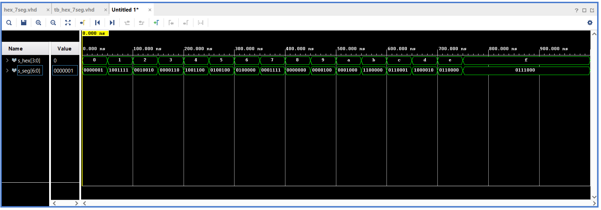

# **04-segment**

## 1.Preparation tasks

### *Decoder truth table for common anode 7-segment display.*

| Hex | Inputs | A | B | C | D | E | F | G |
| :-: | :-: | :-: | :-: | :-: | :-: | :-: | :-: | :-: |
| 0 | 0000 | 0 | 0 | 0 | 0 | 0 | 0 | 1 |
| 1 | 0001 | 1 | 0 | 0 | 1 | 1 | 1 | 1 |
| 2 | 0010 | 0 | 0 | 1 | 0 | 0 | 1 | 0 |
| 3 | 0011 | 0 | 0 | 0 | 0 | 1 | 1 | 0 |
| 4 | 0100 | 1 | 0 | 0 | 1 | 1 | 0 | 0 |
| 5 | 0101 | 0 | 1 | 0 | 0 | 1 | 0 | 0 |
| 6 | 0110 | 0 | 1 | 0 | 0 | 0 | 0 | 0 |
| 7 | 0111 | 0 | 0 | 0 | 1 | 1 | 1 | 1 |
| 8 | 1000 | 0 | 0 | 0 | 0 | 0 | 0 | 0 |
| 9 | 1001 | 0 | 0 | 0 | 0 | 1 | 0 | 0 |
| A | 1010 | 0 | 0 | 0 | 1 | 0 | 0 | 0 |
| b | 1011 | 1 | 1 | 0 | 0 | 0 | 0 | 0 |
| C | 1100 | 0 | 1 | 1 | 0 | 0 | 0 | 1 |
| d | 1101 | 1 | 0 | 0 | 0 | 0 | 1 | 0 |
| E | 1110 | 0 | 1 | 1 | 0 | 0 | 0 | 0 |
| F | 1111 | 0 | 1 | 1 | 1 | 0 | 0 | 0 |


## 2.Seven-segment display decoder
### *VHDL architecture*
```vhdl
architecture Behavioral of hex_7seg is
begin

    p_7seg_decoder : process(hex_i)
    begin
        case hex_i is --Klasický case
            when "0000" =>
                seg_o <= "0000001";     -- 0
            when "0001" =>
                seg_o <= "1001111";     -- 1
            when "0010" =>
                seg_o <= "0010010";     -- 2
            when "0011" =>
                seg_o <= "0000110";     -- 3
            when "0100" =>
                seg_o <= "1001100";     -- 4
            when "0101" =>
                seg_o <= "0100100";     -- 5
            when "0110" =>
                seg_o <= "0100000";     -- 6
            when "0111" =>
                seg_o <= "0001111";     -- 7
            when "1000" =>
                seg_o <= "0000000";     -- 8
            when "1001" =>
                seg_o <= "0000100";     -- 9
            when "1010" =>
                seg_o <= "0001000";     -- A (10)
            when "1011" =>
                seg_o <= "1100000";     -- B (11)
            when "1100" =>
                seg_o <= "0110001";     -- C (12)
            when "1101" =>
                seg_o <= "1000010";     -- D (13)
            when "1110" =>
                seg_o <= "0110000";     -- E (14)
            when others =>
                seg_o <= "0111000";     -- F (15) (když cokoliv jiného)
        end case;
    end process p_7seg_decoder;

end Behavioral;

```
### *VHDL stimulus process*

```vhdl
architecture Behavioral of tb_hex_7seg is

    -- Local signals
    signal s_hex       : std_logic_vector(4 - 1 downto 0);
    signal s_seg       : std_logic_vector(7 - 1 downto 0);

begin

    -- Connecting testbench signals with hex_7seg entity (Unit Under Test)
    uut_hex_7seg : entity work.hex_7seg
        port map(
            hex_i           => s_hex,
            seg_o           => s_seg
        );
p_stimulus : process
    begin
        -- Report a note at the begining of stimulus process
        report "Stimulus process started" severity note;
        
        s_hex <= "0000"; wait for 50 ns; --0
        
        s_hex <= "0001"; wait for 50 ns; --1
        
        s_hex <= "0010"; wait for 50 ns; --2
        
        s_hex <= "0011"; wait for 50 ns; --3
        
        s_hex <= "0100"; wait for 50 ns; --4
        
        s_hex <= "0101"; wait for 50 ns; --5
        
        s_hex <= "0110"; wait for 50 ns; --6
        
        s_hex <= "0111"; wait for 50 ns; --7
        
        s_hex <= "1000"; wait for 50 ns; --8
        
        s_hex <= "1001"; wait for 50 ns; --9
        
        s_hex <= "1010"; wait for 50 ns; --A
        
        s_hex <= "1011"; wait for 50 ns; --b
        
        s_hex <= "1100"; wait for 50 ns; --C
        
        s_hex <= "1101"; wait for 50 ns; --d
        
        s_hex <= "1110"; wait for 50 ns; --E    
  
        s_hex <= "1111"; wait for 50 ns; --F
  
        -- Report a note at the end of stimulus process
        report "Stimulus process finished" severity note;
        wait;
    end process p_stimulus;

end Behavioral;


```
### *Screenshot with simulated time waveforms*



### *VHDL code from source file top.vhd*

```vhdl
hex2seg : entity work.hex_7seg
        port map(
            hex_i            => SW,
            
            seg_o(6)         => CA,
            seg_o(5)         => CB,
            seg_o(4)         => CC,
            seg_o(3)         => CD,
            seg_o(2)         => CE,
            seg_o(1)         => CF,
            seg_o(0)         => CG
        );
```

## 3.LED(7:4) indicators

###

| **Hex** | **Inputs** | **LED4** | **LED5** | **LED6** | **LED7** |
| :-: | :-: | :-: | :-: | :-: | :-: |
| 0 | 0000 | 0 | 1 | 1 | 1 |
| 1 | 0001 | 1 | 1 | 0 | 0 |
| 2 | 0010 | 1 | 1 | 1 | 0 |
| 3 | 0011 | 1 | 1 | 0 | 1 |
| 4 | 0100 | 1 | 1 | 1 | 0 |
| 5 | 0101 | 1 | 1 | 0 | 1 |
| 6 | 0110 | 1 | 1 | 1 | 1 |
| 7 | 0111 | 1 | 1 | 0 | 1 |
| 8 | 1000 | 1 | 1 | 1 | 0 |
| 9 | 1001 | 1 | 1 | 0 | 1 |
| A | 1010 | 1 | 0 | 1 | 1 |
| b | 1011 | 1 | 0 | 0 | 1 |
| C | 1100 | 1 | 0 | 1 | 1 |
| d | 1101 | 1 | 0 | 0 | 1 |
| E | 1110 | 1 | 0 | 1 | 1 |
| F | 1111 | 1 | 0 | 0 | 1 |
