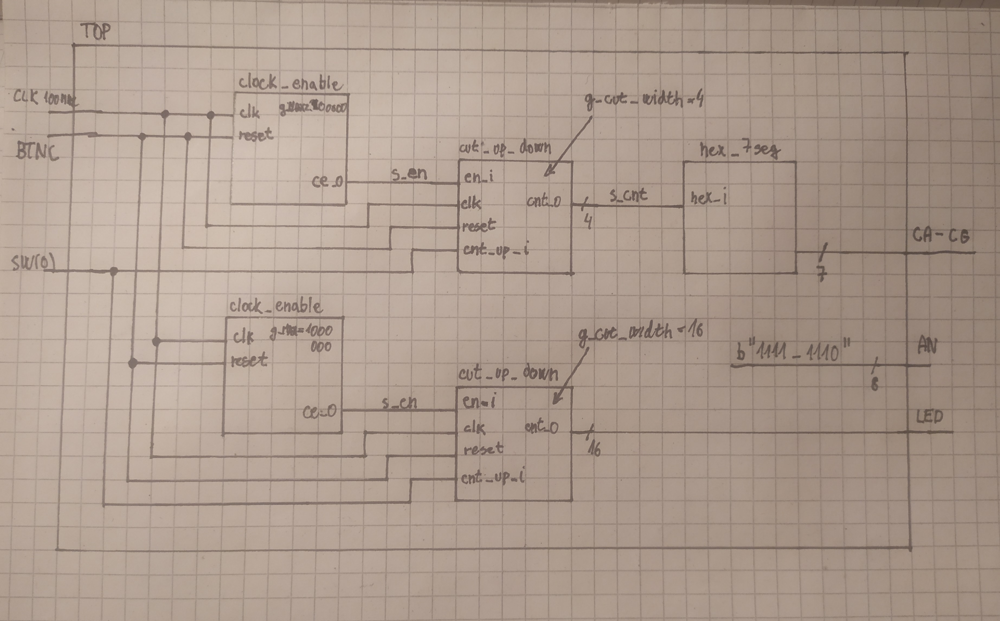

# **05-binary counter**

## 1.Preparation tasks

### *Figure or table with connection of push buttons on Nexys A7 board*

  | **Button name** | **Connection** | **Logic/voltage value while pressed** | **Logic/voltage value while not pressed** |
   | :-: | :-: | :-: | :-: |
   | BTNL | P17 | 1/3.3V | 0/0V |
   | BTNR | M17 | 1/3.3V | 0/0V |
   | BTNU | M18 | 1/3.3V | 0/0V |
   | BTND | P18 | 1/3.3V | 0/0V |
   | BTNC | N17 | 1/3.3V | 0/0V |
   
### *Table with calculated values*
   
   | **Time interval** | **Number of clk periods** | **Number of clk periods in hex** | **Number of clk periods in binary** |
   | :-: | :-: | :-: | :-: |
   | 2&nbsp;ms | 200 000 | `x"3_0d40"` | `b"0011_0000_1101_0100_0000"` |
   | 4&nbsp;ms | 400 000 | `x"6_1a80"` | `b"0110_0001_1010_1000_0000"` |
   | 10&nbsp;ms | 1 000 000 | `x"f_4240"` | `b"1111_0100_0010_0100_0000"` |
   | 250&nbsp;ms | 25 000 000 | `x"17d_7840"` | `b"0001_0111_1101_0111_1000_0100_0000"` |
   | 500&nbsp;ms | 50 000 000 | `x"2f2_f080"` | `b"0010_1111_1010_1111_0000_1000_0000"` |
   | 1&nbsp;sec | 100 000 000 | `x"5F5_E100"` | `b"0101_1111_0101_1110_0001_0000_0000"` |
   
 
## 2.Bidirectional counter

### *VHDL code of the process p_cnt_up_down*
```vhdl
begin
 p_cnt_up_down : process(clk)
    begin
        if rising_edge(clk) then
        
            if (reset = '1') then               
                s_cnt_local <= (others => '0'); 

            elsif (en_i = '1') then      


                if (cnt_up_i = '1') then
                    s_cnt_local <= s_cnt_local + 1;
                else
                    s_cnt_local <= s_cnt_local - 1;

                end if;
            end if;
       end if;
    end process p_cnt_up_down;
    
    --Output must be retyped from "unsigned" to "std_logic_vector"
    cnt_o <= std_logic_vector(s_cnt_local);

end architecture behavioral;
```
### *VHDL reset and stimulus processes from testbench file tb_cnt_up_down.vhd*

```vhdl
  
    -- Reset generation process
  
    p_reset_gen : process
    begin
        s_reset <= '0';
        wait for 12 ns;
        
        s_reset <= '1';
        wait for 73 ns;

        s_reset <= '0';
        wait;
    end process p_reset_gen;

   
    -- Data generation process
    
    p_stimulus : process
    begin
        report "Stimulus process started" severity note;

        s_en     <= '1';
        
        s_cnt_up <= '1';
        wait for 380 ns;
        s_cnt_up <= '0';
        wait for 220 ns;

        s_en     <= '0';

        report "Stimulus process finished" severity note;
        wait;
    end process p_stimulus;
```
### *Screenshot with simulated time waveforms*


## 3.Top level
### *VHDL code from source file top.vhd with all instantiations for the 4-bit bidirectional counter*
```vhdl
begin
    -- Instance (copy) of clock_enable entity
    
    clk_en0 : entity work.clock_enable
        generic map(
            g_MAX   => 100000000
        )
        port map(
            clk     => CLK100MHZ,
            reset   => BTNC,
            ce_o    => s_en
        );

    -- Instance (copy) of cnt_up_down entity
    
    bin_cnt0 : entity work.cnt_up_down
        generic map(
            g_CNT_WIDTH =>  4
        )
        port map(
            clk         =>  CLK100MHZ,
            reset       =>  BTNC,
            en_i        =>  s_en,
            cnt_up_i    =>  SW(0),
            cnt_o       =>  s_cnt
        );
        
    LED(3 downto 0) <= s_cnt;
    
    
    hex2seg : entity work.hex_7seg
        port map(
            hex_i    => s_cnt,
            seg_o(6) => CA,
            seg_o(5) => CB,
            seg_o(4) => CC,
            seg_o(3) => CD,
            seg_o(2) => CE,
            seg_o(1) => CF,
            seg_o(0) => CG
        ); 
       
    AN <= b"1111_1110";

end architecture Behavioral;       
```
### *Image of the top layer including both counters*

